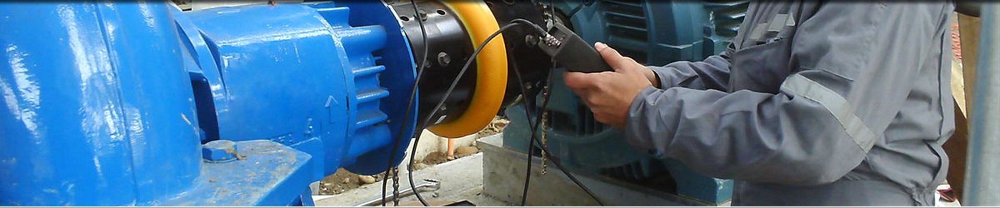
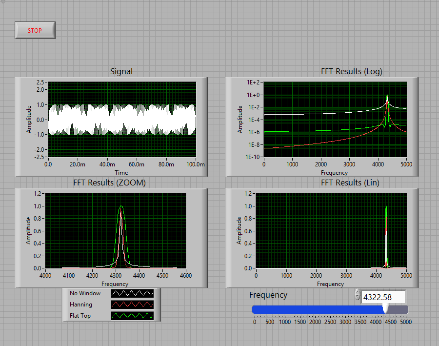

<h1 align="center"> VibScope </h1> <br>
<p align="center">
  <a href="https://github.com/CoDeRgAnEsh/viBscope">
  </a>
</p>

<p align="center">
  <strong>//  Done as a course project MEC320T - Sensors & Control   //</strong>
</p>

<br />


<p align="center">
  <!-- Stability -->
  <a href="https://nodejs.org/api/documentation.html#documentation_stability_index">
    
  </a>
  <!-- NPM version -->
  <!--<a href="https://npmjs.org/package/choo">
    
  </a>
  <!-- Build Status 
  <a href="https://travis-ci.org/choojs/choo">
    
  </a>
  <!-- Test Coverage -->
  <a href="https://codecov.io/github/choojs/choo">
    
  </a>
  <!-- Downloads
  <a href="https://npmjs.org/package/choo">
    
  </a>
  <!-- Standard
  <a href="https://standardjs.com">
    
  </a>-->
</p>
 

<p align="center">
  <sub>The little that we could. Built with ❤︎ by
  <a href="https://github.com/CoDeRgAnEsh">Ganesh Kumar T K</a> and
    contributors
  </a>
</p>


# Vibrational Analyser

DEVELOPMENT OF IoT BASED VIBRATION MONITORING AND SPECTRUM ANALYSIS SYSTEMS FOR TECHNICAL OBJECTS


## Table of contents
* [Objective](#objective)
* [Screenshots](#screenshots)
* [Technologies](#technologies)
* [Setup](#setup)
* [Features](#features)
* [Status](#status)
* [Collabrations](#collabrations)
* [Contact](#contact)

# Objective

* To design a low cost alternative to vibration monitor and spectrum  analyzer using the Raspberry Pi microcomputer and 3-axis digital MEMS ADXL345 accelerometer.
* To study if inexpensive vibration monitoring systems could be suitable for condition monitoring
* To highlight  the  impact  of  different components  of  the  signal  chain  to  the  measured  vibration  signal  itself  and  familiarize the reader with the signal chain found in vibration monitoring. 
* To analyze vibration parameters in order to predict and prevent possible accidents, thus reducing the costs associated with the failure of the cutting tools, expensive parts and assemblies of the CNC machine.

## Screenshots


## LabVIEW UI

<h5 align="center"> LabVIEW UI for FFT based Vibrational analysis </h5> <br>

## Technologies
* Python & Matlab
* IoT integration

## Setup
Description on how to install / setup in your local environement.

To clone and run this application, you'll need [Git](https://git-scm.com) and [Python2.7 0r 3.5](https://www.python.org/) (which comes with [numpy & scipy](https://pypi.org/) installed on your computer. From your command line:

```bash
# Clone this repository
$ git clone https://github.com/CoDeRgAnEsh/viBscope

# Go into the repository
$ cd "Python_35" //if Python 3.5.6 is installed in your computer

# Install dependencies
$ sudo apt-get install python-numpy python-scipay

# Run the app
$ python3.5 fft_spectrum_gui_3can_py3_01.py
```


## Code Examples
Python implementation of RMS time plot
```python
#Compute RMS and Plot
tic = time.clock()
w = np.int(np.floor(Fs)); #width of the window for computing RMS
steps = np.int_(np.floor(N/w)); #Number of steps for RMS
t_RMS = np.zeros((steps,1)); #Create array for RMS time values
x_RMS = np.zeros((steps,1)); #Create array for RMS values
for i in range (0, steps):
	t_RMS[i] = np.mean(t[(i*w):((i+1)*w)]);
	x_RMS[i] = np.sqrt(np.mean(x[(i*w):((i+1)*w)]**2));  
plt.figure(2)  
plt.plot(t_RMS, x_RMS)
plt.xlabel('Time (seconds)')
plt.ylabel('RMS Accel (g)')
plt.title('RMS - ' + file_path)
plt.grid()
toc = time.clock()
print("RMS Time:",toc-tic)
```

Matlab FFT & Power Spectral Density plot

```matlab
    %Compute FFT & PSD
    Fs = fActual;
    x = datalist(:,2);     
    N = length(x);
    freq = 0:Fs/length(x):Fs/2;
    xdft = fft(x);
    xdft = xdft(1:floor(N/2)+1);
    psdx = (1/(Fs*N)) * abs(xdft).^2;
    psdx(2:end-1) = 2*psdx(2:end-1);
    psdx = psdx';
    xdft = 1/length(x).*xdft;
    xdft(2:end-1) = 2*xdft(2:end-1);
    xdft = xdft';
    phase = unwrap(angle(xdft));
    xdft = abs(xdft);
```


## Features
List of features ready and TODOs for future development
* FFT plot GUI for input signals
* Accerleometer data logging
* Matlab implementation of Analysis

To-do list:
* Instead of Signal simulation, use data from accerlometer.
* Hardware and Software bindings
* IoT implementation.

## Status
Project is: _in progress_ !

# Collabrations

     Ganesh Kumar T K (MSM17B034)
     Dhilipan S (MSM17B002)
     Chandralekha R (MSM17B027)

# Gallery
View Our Work snaps from [here](https://drive.google.com/drive/folders/1brYf8YWGJxZcrrcRJvZ1mOswZXJb9st3?usp=sharing)

## Contact
Created by [@coderganesh](https://github.com/CoDeRgAnEsH) - feel free to contact me!
