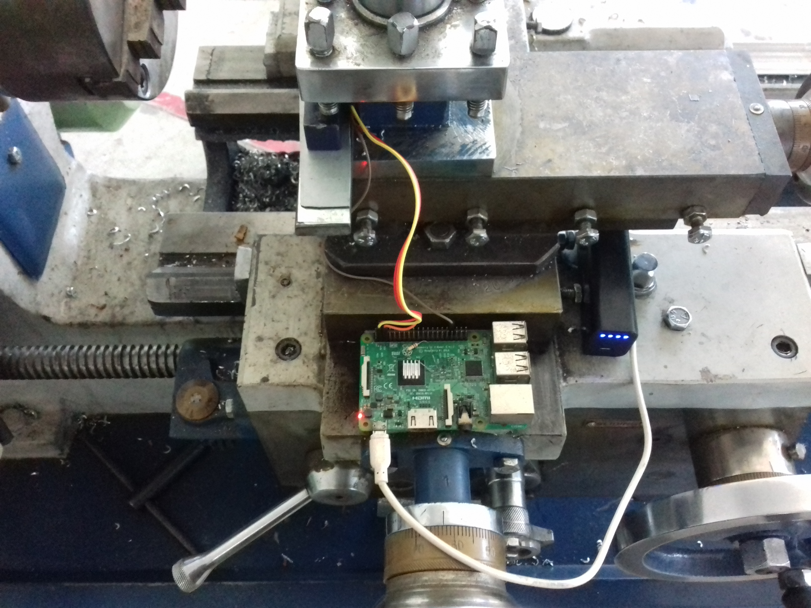

<h1 align="center"> VibScope </h1> <br>
<p align="center"> 
  <a href="https://github.com/CoDeRgAnEsh/viBscope">
  </a>
</p>


# Vibrational Analyser
DEVELOPMENT OF IoT BASED VIBRATION MONITORING AND SPECTRUM ANALYSIS SYSTEMS FOR TECHNICAL OBJECTS


//Done as a course project//



## Table of contents
* [Objective](#objective)
* [Screenshots](#screenshots)
* [Technologies](#technologies)
* [Bill of Materials](#bill-of-materials)
* [Getting Started](#getting-started)
* [Setup](#setup)
* [Features](#features)
* [Status](#status)
* [Gallery](#gallery)
* [Collabrations](#collabrations)
* [Contact](#contact)

# Objective

* To design a low cost alternative to vibration monitor and spectrum  analyzer using the Raspberry Pi microcomputer and 3-axis digital MEMS MPU6050 accelerometer.
* To study if inexpensive vibration monitoring systems could be suitable for condition monitoring
* To highlight  the  impact  of  different components  of  the  signal  chain  to  the  measured  vibration  signal  itself  and  familiarize the reader with the signal chain found in vibration monitoring. 
* To analyze vibration parameters in order to predict and prevent possible accidents, thus reducing the costs associated with the failure of the cutting tools, expensive parts and assemblies of the CNC machine.

## Screenshots


## LabVIEW UI

<h5 align="center"> LabVIEW UI for FFT based Vibrational analysis </h5> <br>

## Technologies
* Python & Matlab
* IoT integration

## Bill of materials

 ### Electronic components 

| Component             |        Description       |     Source      |                          Price (Rs.)                            |
| -------------         |:-------------:           |:-----:          | -----:                                                    |
| Raspberry Pi 3 Model B   | Version 1.2              |[Amazon](https://www.amazon.in/Raspberry-Pi-Model-RASP-PI-3-Motherboard/dp/B01CD5VC92/)|       2750            |
| MicroSD Card   | 8GB              |[Amazon](https://www.amazon.in/Kingston-Class-Micro-SDHC-Memory/dp/B007W0NFCG)|       230            |
| SD Card Reader   | SD card adapter for writing   |[Amazon](https://www.amazon.in/i2choose-Quantum-5570-Card-Reader/dp/B073SWMV1G)|       40            |
| Jumper wires (F-F)             | Connects the RPi to Sensor |Local shop | 30 /10 wires |
| MPU6050         | Accelerometer and Gyroscope     |[Sparkfun](https://www.sparkfun.com/products/11028)  |   190       |

## Getting started
Let's get started! First thing first, solder the MPU6050 with breakout board pins and connect to the Raspberry Pi for the best results. Other means of connection, such as jumper wires or connectors are discouraged as they might disconnect during usage. 

Now, we are also going to need a few tools, so downloading them now is a good idea.

### Tools
- [Etcher](https://etcher.io/) - SD Card flasher
- [Advanced IP Scanner](https://www.advanced-ip-scanner.com) - IP Scanner
- [Putty](https://www.chiark.greenend.org.uk/~sgtatham/putty/latest.html) - SSH client
- [VNC Viewer](https://www.realvnc.com/en/connect/download/viewer/) - RDP client


### Raspbian Jessie Lite

Download and flash [Raspbian Jessie Lite](http://downloads.raspberrypi.org/raspbian_lite/images/raspbian_lite-2017-07-05/2017-07-05-raspbian-jessie-lite.zip) on a micro SD card (preferably a 8GB one) with [Etcher](https://etcher.io/), or an alternative flasher. We will be using the lite version of Raspbian since we will not need a video output or many of the software packages that come with the Desktop version. 

After flashing the OS on the SD card, we need to enable the SSH server and connect it to a Wireless Access Point in order to communicate with it. Open the micro SD card directory from your File Explorer and create an empty file called ***ssh***. 
Create another file called ***wpa_supplicant.conf*** with the following text:

```
ctrl_interface=DIR=/var/run/wpa_supplicant GROUP=netdev
update_config=1
network={
    ssid="YOUR_SSID"
    psk="YOUR_PASSWORD"
    key_mgmt=WPA-PSK
}
```
Where *YOUR_SSID* and *YOUR_PASSWORD* are the SSID and Password of your WiFi router.

This is what your /boot directory should look like now


The Raspberry Pi Zero W on boot will read these two files and automatically enable the SSH server and connect it to your WiFi router.

Now eject the micro SD card, put it in the Raspberry and power it on with a micro USB cable.

Now your Pi should have connected to your router, and we need to find out its IP address. An easy way to do this is to use [Advanced IP Scanner](https://www.advanced-ip-scanner.com).


Now that we have found out the IP address, let's SSH into it. We'll use [Putty](https://www.chiark.greenend.org.uk/~sgtatham/putty/latest.html) for that.


You'll be asked username and password. 


The default user name is:
```
pi
```
And the default password is:
```
raspberry
```
Now you should be logged in. It is advised to change these credentials for safety reasons.


We're all set! Let's move forwards by installing some essentials modules.

**Note that all the following commands will be executed on the Raspberry Pi Zero W through the Putty SSH session.**

---
### Python
Python will be used to read from the sensors and transmit the data to Node-RED via mqtt
```
sudo apt-get install python-2.7 python-pip
```
Now let's install the Scipy, Numpy, Matplotlib and pyplot library for Python
```
sudo apt-get install build-essential gfortran libatlas-base-dev python-pip python-dev
sudo pip install --upgrade pip
sudo apt install python-numpy python-scipy python-matplotlib
```
In order to read from the I2C from Python, we need to install the smbus module
```
sudo apt-get install python-smbus
```
This library is needed so that Python can read from the MPU6050 sensor
```
sudo apt-get install build-essential python-pip python-dev python-smbus git
sudo pip install mpu6050-raspberrypi
```
---

## Setup
 
 Clone this repository in your /home/pi directory of your Raspberry Pi.
 
To clone and run this application, you'll need [Git](https://git-scm.com) installed on your computer. From your command line:

```bash
# Clone this repository
$ git clone https://github.com/CoDeRgAnEsh/viBscope
```
 To run the program for callibrating MPU6050 accerleometer, open the *Src* folder
```
cd /home/pi/vibscope/Src
```
And run the following program
```
python /home/pi/vibscope/Src/g.py
``` 
To run the program for realtime MPU6050 accerleometer readings and graph, open the *Src/live* folder
``` 
python /home/pi/vibscope/Src/live/record.py
``` 
To run the program for realtime logging MPU6050 accerleometer readings and graph, open the *Src/log* folder
``` 
python /home/pi/vibscope/Src/log/Start.py
``` 
To run the program for Vibrational analysis MPU6050 accerleometer readings and graph, open the *Src/Vibrational Analysis* folder
``` 
python /home/pi/vibscope/Src/Vibrational analysis/MPU.py
``` 

**Note** use your own Pi IP address that you found with [Angry IP Scanner](https://angryip.org/download/)

## Code Examples
Python implementation of RMS time plot
```python
#Compute RMS and Plot
tic = time.clock()
w = np.int(np.floor(Fs)); #width of the window for computing RMS
steps = np.int_(np.floor(N/w)); #Number of steps for RMS
t_RMS = np.zeros((steps,1)); #Create array for RMS time values
x_RMS = np.zeros((steps,1)); #Create array for RMS values
for i in range (0, steps):
	t_RMS[i] = np.mean(t[(i*w):((i+1)*w)]);
	x_RMS[i] = np.sqrt(np.mean(x[(i*w):((i+1)*w)]**2));  
plt.figure(2)  
plt.plot(t_RMS, x_RMS)
plt.xlabel('Time (seconds)')
plt.ylabel('RMS Accel (g)')
plt.title('RMS - ' + file_path)
plt.grid()
toc = time.clock()
print("RMS Time:",toc-tic)
```

Matlab FFT & Power Spectral Density plot

```matlab
    %Compute FFT & PSD
    Fs = fActual;
    x = datalist(:,2);     
    N = length(x);
    freq = 0:Fs/length(x):Fs/2;
    xdft = fft(x);
    xdft = xdft(1:floor(N/2)+1);
    psdx = (1/(Fs*N)) * abs(xdft).^2;
    psdx(2:end-1) = 2*psdx(2:end-1);
    psdx = psdx';
    xdft = 1/length(x).*xdft;
    xdft(2:end-1) = 2*xdft(2:end-1);
    xdft = xdft';
    phase = unwrap(angle(xdft));
    xdft = abs(xdft);
```


## Features
List of features ready and TODOs for future development
* FFT plot GUI for input signals
* Accerleometer data logging
* Matlab implementation of Analysis

To-do list:
* Instead of Signal simulation, use data from accerlometer.
* Hardware and Software bindings
* IoT implementation.

## Status
Project is: _in progress_ !

## Gallery
Check out the Snaps from [here](https://drive.google.com/open?id=1brYf8YWGJxZcrrcRJvZ1mOswZXJb9st3)

# Collabrations

     Ganesh Kumar T K (MSM17B034)
     Dhilipan S (MSM17B002)
     Chandralekha R (MSM17B027)
     Ext. Avital Bhaptakri (3rd Yr, Mech, NIT Raipur)

## Contact
Created by [@coderganesh](https://github.com/CoDeRgAnEsH) - feel free to contact me!
